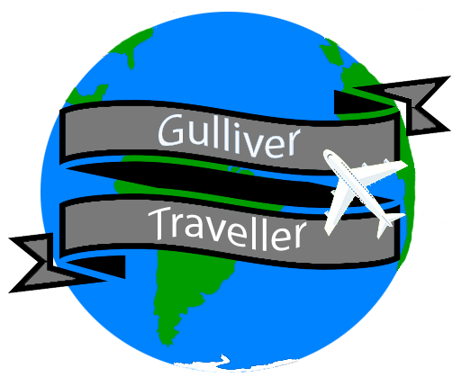

<h1 align="center">
    
</h1>
<h4 align="center"> 
	🚧 🚀 Concluido... 🚧
</h4>

### ✅ GlobalSolution

### Case Guliver Traveller
Gulliver Traveller é um jovem blogueiro de 26 anos, amante de viagens de
turismo e explorador de lindas cidades e paisagens de encher os olhos. Em seu blog,
Gulliver conta todas as suas aventuras e desbravamentos pelos confins do mundo
trazendo, para seus leitores, dicas de viagens e de lugares pouco explorados pelos
turistas menos experientes.
Gulliver pretende expandir suas buscas e dividir todas as informações
necessárias para um turista poder se programar e explorar o mundo como ele. Mas
todas as vezes que nosso explorador programa suas viagens, tem que navegar por
diversos blogs, sites, companhias aéreas, hotéis, locais, pontos turísticos
(principalmente os mais recomendados e imperdíveis). E a dificuldade aumenta
quando procura pelos melhores lugares para se hospedar, clima, temperatura, melhor
época do ano para conhecer, roteiros gastronômicos para todos os gostos e bolsos,
comidas regionais, roteiros de compras (com referências e como chegar) serviços
diversos e onde localizá-los, além de indicações de serviços, desde hospitais até
lavanderias.
Uau! Agora Gulliver está pensando grande e percebeu que seu blog não será
suficiente para suas ambições e objetivos. Gulliver não tem conhecimentos
aprofundados em tecnologia e ferramentas que lhe dê suporte à sua magnífica ideia.
O que fazer diante dessa situação? Como resolver esse problema tão complexo?
Esse obstáculo não é suficiente para que as metas de Gulliver sejam
abandonadas ao vento e, diante disso, ele procura ajuda de um profissional de
Tecnologia da Informação para colocar em prática o que vamos chamar de Projeto
Traveller

#### Cenários escolhidos: 
	▪Para a opção “Dicas úteis”, nesta versão piloto, devem ser apresentadas as opções, com
	respectivo descritivo:
		▪ Quando ir;
		▪ Temperatura média anual;
		▪ Fuso horário;
		▪ Tempo médio de permanência conforme objetivo, negócios ou passeio;
		▪ Idioma;
		▪ Voltagem e tipo de tomada;
		▪ Moeda;
		▪ Documentos necessários;
		▪ Bagagem e;
		▪ Como se locomover.
		
		
	▪Para a opção “Parques”, nesta versão piloto, devem ser apresentadas as seguintes
	informações:
	Alguns destaques:
		▪ Parque do Ibirapuera;
		▪ Jardim Botânico de São Paulo;
		▪ Parque Alfredo Volpi;
		▪ Parque Buenos Aires e;
		▪ Parque da Independência.
	Em cada opção deverá haver uma imagem, com a legenda do respectivo local e avaliação
	dos usuários.
	As opções sugeridas, devem ser apresentadas, conforme avaliação, em ordem decrescente.
	Ao selecionar a imagem, serão apresentadas as seguintes informações:
		▪ Breve descrição;
		▪ Localização com mapa e como chegar;
		▪ Horário de funcionamento e;
		▪ Link de acesso ao site oficial.
	Permitir que o usuário faça a recomendação/avaliação do espaço visitado.
	
	
### 🛠 Tecnologias

As seguintes ferramentas foram usadas na construção do projeto:

- [HTML5](https://www.devmedia.com.br/o-que-e-o-html5/25820)  
- [CSS](https://developer.mozilla.org/pt-BR/docs/Web/CSS0) 
- [BOOTSTRAP](https://pt.wikipedia.org/wiki/Bootstrap_(framework_front-end))

## 👥 Contribuitors
<table>
	<tr>
	     <td align="center"><a href="https://github.com/JhoctanTeixeira"> <b>Jhoctan Teixeira</b></a> <a href="https://github.com/JhoctanTeixeira" title="Jhoctan-Teixeira">🚀💻</a></td>
		<td align="center"><a href="https://github.com/enzo-b-pagliacci"> <b>enzo-b-pagliaci</b></a> <a href="https://github.com/enzo-b-pagliacci" title="enzo-b-pagliaci">🚀💻</a></td>
    		<td align="center"><a href="https://github.com/Gustavo-Lopes-Carlin-fiap"> <b>Gustavo-Lopes-Carlin-fiap</b></a> <a href="https://github.com/Gustavo-Lopes-Carlin-fiap" title="Gustavo">🚀💻</a></td>
    		<td align="center"><a href="https://github.com/Guilherme-Beck-FIAP"> <b>Guilherme-Beck-FIAP</b></a> <a href="https://github.com/Guilherme-Beck-FIAP" title="enzo-b-pagliaci">🚀💻</a></td>
    		<td align="center"><a href="https://github.com/Gabrielrpg68"> <b>Gabrielrpg68</b></a> <a href="https://github.com/Gabrielrpg68" title="enzo-b-pagliaci">🚀💻</a></td>
	</tr>
</table>
